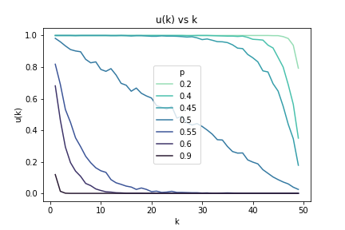
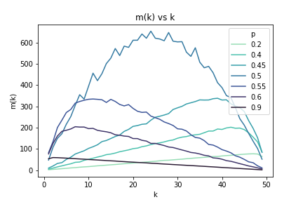
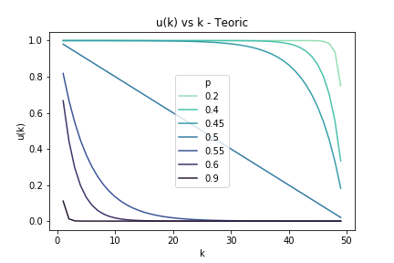
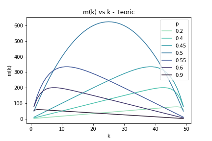

# Stochastics_Review

In this repository I keep some simulations, using Montecarlo techniques and posteriorly, if possible comparing them to the teoric solution.

## Gamblers ruin

Consider a game with two players where player one has a probability $p$ chance of winning at every round. After each round loser transfers one penny to the winner. The game ends when one player has all the pennies.  

If there are no other limitations on the rounds, the probability that the game will eventually end this way is 1. (This is due to 0 and N are absorbing states and demonstrations of this probability can be found in most text books that have _random walks_ or _Markov Chain_).

Player one starts with $k$ points, and the probability of him winning each round is $p$. Player 2 starts with $N-k$ points, so the number of points in the game will always be constant $N$.

Let $u_k$ represent the expectation that the game is absorbed by state 0. Formally, let $\tau = min\{ n \geq 0 : X_n = 0 or X_n = N \}$ then:

$u_k = P(X_{\tau} = 0 \; |\;  X_0 = k \}$

Then  

$$
u_k = 
     \begin{cases}
       \frac{N - k}{N} & \quad \text{if} \quad p = 1/2\\
       \frac{(q/p) ^ k - (q/p) ^ N}{1 - (q/p) ^ N} & \quad \text{if} \quad  p \neq 1/2 \\

     \end{cases}
$$
And let $m_k$ represent the expected number of rounds before game ending
$$
m_k = 
     \begin{cases}
       K(N - k) & \quad \text{if} \quad p = 1/2\\
       \frac{1}{q-p} (k - N \frac{1 - (q/p)^k }{1 - (q/p)^N}) & \quad \text{if} \quad  p \neq 1/2 \\

     \end{cases}
$$

#### Numeric Approximation
Done using Montercarlo simulation, shown in the *jupyter notebook*. Data of the simulations is also loaded.

  

#### Teoric Approximation

  

